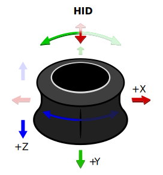
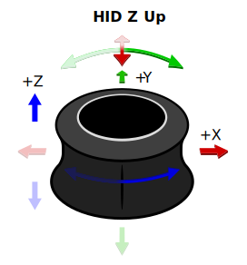
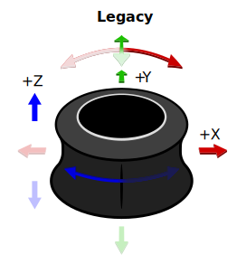

# API documentation for this tool

Documentation for PySpaceMouse is generated by [MkDoxy](https://mkdoxy.kubaandrysek.cz/).

## Examples

More examples can be found in [Examples](./examples.md) page.

## Module pyspacemouse

The module-level API is as follows:

    open(callback=None, button_callback=None, button_callback_arr=None, set_nonblocking_loop=True, device=None)
        Open a 3D space navigator device. Makes this device the current active device, which enables the module-level read() and close()
        calls. For multiple devices, use the read() and close() calls on the returned object instead, and don't use the module-level calls.

        Parameters:
            callback: If callback is provided, it is called on each HID update with a copy of the current state namedtuple
            dof_callback: If dof_callback is provided, it is called only on DOF state changes with the argument (state).
            button_callback: If button_callback is provided, it is called on each button push, with the arguments (state_tuple, button_state)
            device: name of device to open, as a string like "SpaceNavigator". Must be one of the values in `supported_devices`.
                    If `None`, chooses the first supported device found.
        Returns:
            Device object if the device was opened successfully
            None if the device could not be opened

    read()              Return a namedtuple giving the current device state (t,x,y,z,roll,pitch,yaw,button)
    close()             Close the connection to the current device, if it is open
    list_devices()      Return a list of supported devices found, or an empty list if none found

`open()` returns a DeviceSpec object.
If you have multiple 3Dconnexion devices, you can use the object-oriented API to access them individually.
Each object has the following API, which functions exactly as the above API, but on a per-device basis:

    dev.open()          Opens the connection (this is always called by the module-level open command,
                        so you should not need to use it unless you have called close())
    dev.read()          Return the state of the device as namedtuple [t,x,y,z,roll,pitch,yaw,button]
    dev.close()         Close this device

There are also attributes:

    dev.connected       True if the device is connected, False otherwise
    dev.state           Convenience property which returns the same value as read()

## State Objects

State objects returned from `read()` have 7 attributes: [t,x,y,z,roll,pitch,yaw,button].

* t: timestamp in seconds since the script started.
* x,y,z: translations in the range [-1.0, 1.0]
* roll, pitch, yaw: rotations in the range [-1.0, 1.0].
* buttons: list of button states (0 or 1), in order specified in the device specifier

## Axis Conventions

Built-in device specs can be opened with an explicit axis convention:

```python
import pyspacemouse
from pyspacemouse import AxisConvention

with pyspacemouse.open(axis_convention=AxisConvention.HID_Z_UP) as device:
    state = device.read()
```

<p align="center">
  
  
  
</p>

The same `axis_convention` argument is available on `open_by_path()` and
`open_with_config()`.

| Convention | Translation axes | Rotation axes                                  | Notes                                                                                                              |
|------------|------------------|------------------------------------------------|--------------------------------------------------------------------------------------------------------------------|
| `AxisConvention.HID` | `+x` right, `+y` toward the user, `+z` down | right-handed                                   | USB HID convention; see [HID Usage Tables, 4.2 Axis Usages](https://usb.org/document-library/hid-usage-tables-17). |
| `AxisConvention.HID_Z_UP` | `+x` right, `+y` away from the user, `+z` up | right-handed                                   | HID frame, rotated -180 degrees about +X so Z points up                                                            |
| `AxisConvention.ROS` | `+x` forward, `+y` left, `+z` up | right-handed                                   | ROS REP 103 body frame.                                                                                            |
| `AxisConvention.UNITY` | `+x` right, `+y` up, `+z` forward | left-handed                                    | Unity world/object frame.                                                                                          |
| `AxisConvention.LEGACY` | `x=+HID_x`, `y=-HID_y`, `z=-HID_z` | `roll=-HID_Ry`, `pitch=-HID_Rx`, `yaw=+HID_Rz` | Deprecated. Default for backward compatibility.                                                                    |

For new code, select a convention that matches your need. Use `AxisConvention.LEGACY` only for existing code that
depends on the old PySpaceMouse signs or labels.

Custom `device_spec` mappings are used exactly as provided. If you pass a
custom `device_spec`, do not also pass `axis_convention`; adjust the mapping
with `create_device_info()` or `modify_device_info()` instead.

## Custom Device Configuration

You can customize axis mappings without modifying the TOML configuration by using the helper functions:

### `create_device_info()`

Create a completely custom device configuration:

```python
custom = pyspacemouse.create_device_info(
    name="MyDevice",
    vendor_id=0x256F,
    product_id=0xC635,
    mappings={
        "x": (1, 1, 2, 1),      # (channel, byte1, byte2, scale)
        "y": (1, 3, 4, -1),     # Inverted
        "z": (1, 5, 6, -1),
        "pitch": (2, 1, 2, -1),
        "roll": (2, 3, 4, -1),
        "yaw": (2, 5, 6, 1),
    },
    buttons={"LEFT": (3, 1, 0), "RIGHT": (3, 1, 1)},
)
```

### `modify_device_info()`

Modify an existing device spec (e.g., to remap or invert axes):

```python
specs = pyspacemouse.get_device_specs()
base = specs["SpaceNavigator"]

custom = pyspacemouse.modify_device_info(
    base,
    name="SpaceNavigator (Custom)",
    remap_axes={
        "x": "y",
        "y": ("x", -1),
        "yaw": ("yaw", -1),
    },
)
```

### Using Custom Specs

Pass the custom spec to `open()` or `open_by_path()`:

```python
with pyspacemouse.open(device_spec=ros_spec) as device:
    state = device.read()
```
