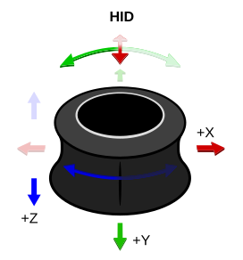
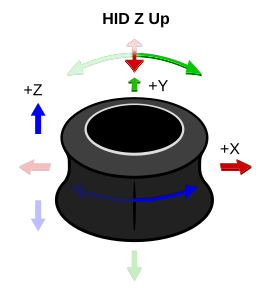
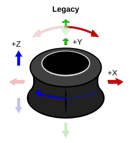

# API documentation for this tool

Documentation for PySpaceMouse is generated by [MkDoxy](https://mkdoxy.kubaandrysek.cz/).

## Examples

More examples can be found in [Examples](./examples.md) page.

## Module pyspacemouse

As described in the examples, you typically want to start by "opening" a device using one of the open functions, then call one of the "read" functions.

### Open Functions

These are module-level functions (e.g. `pyspacemouse.open()`) and should be used in a `with ... as ...` statement.

- `open()`: By default, returns the "first" supported device it finds. Great when you only have one device.
- `open_by_path()`: Opens a specific device (from symlink, `udev` rule, hidraw path, etc.). Great when you need stability across re-plugging or multiple devices.

### Read Functions

These are called on the object returned by the `open` functions.

- `read()`
- `read_latest()`

The main difference is that `read_latest()` handles two comment issues better: old/laggy data, and busy-waiting.
The function `read_latest()` does one blocking call to `read()` which will keep CPU usage low if the device is stationary at all 0s, but will ensure the buffer is drained of data before returning to you the latest data.
This ensures you always get the latest data, regardless of how slowly your loop to `read_latest()` is!
If you use `read()` you must read very quickly (~200Hz in my testing), or the HID/USB buffer does not fill up and you will start to get old data.
This often shows up as "lag" in your application.
In short, if you were previously having

## State Objects

State objects returned from `read()` have 7 attributes: [t,x,y,z,roll,pitch,yaw,button].

* t: timestamp in seconds since the script started.
* x,y,z: translations in the range [-1.0, 1.0]
* roll, pitch, yaw: rotations in the range [-1.0, 1.0].
* buttons: list of button states (0 or 1), in order specified in the device specifier

## Axis Conventions

Built-in device specs can be opened with an explicit axis convention:

```python
import pyspacemouse
from pyspacemouse import AxisConvention

with pyspacemouse.open(axis_convention=AxisConvention.HID_Z_UP) as device:
    state = device.read()
```

<p align="center">
  
  
  
</p>

The same `axis_convention` argument is available on `open_by_path()` and
`open_with_config()`.

| Convention | Translation axes | Rotation axes                                  | Notes                                                                                                              |
|------------|------------------|------------------------------------------------|--------------------------------------------------------------------------------------------------------------------|
| `AxisConvention.HID` | `+x` right, `+y` toward the user, `+z` down | right-handed                                   | USB HID convention; see [HID Usage Tables, 4.2 Axis Usages](https://usb.org/document-library/hid-usage-tables-17). |
| `AxisConvention.HID_Z_UP` | `+x` right, `+y` away from the user, `+z` up | right-handed                                   | HID frame, rotated -180 degrees about +X so Z points up                                                            |
| `AxisConvention.ROS` | `+x` forward, `+y` left, `+z` up | right-handed                                   | ROS REP 103 body frame.                                                                                            |
| `AxisConvention.UNITY` | `+x` right, `+y` up, `+z` forward | left-handed                                    | Unity world/object frame.                                                                                          |
| `AxisConvention.LEGACY` | `x=+HID_x`, `y=-HID_y`, `z=-HID_z` | `roll=-HID_Ry`, `pitch=-HID_Rx`, `yaw=+HID_Rz` | Deprecated. Default for backward compatibility.                                                                    |

For new code, select a convention that matches your need. Use `AxisConvention.LEGACY` only for existing code that
depends on the old PySpaceMouse signs or labels.

Custom `device_spec` mappings are used exactly as provided. If you pass a
custom `device_spec`, do not also pass `axis_convention`; adjust the mapping
with `create_device_info()` or `modify_device_info()` instead.

## Custom Device Configuration

You can customize axis mappings without modifying the TOML configuration by using the helper functions:

### `create_device_info()`

Create a completely custom device configuration:

```python
custom = pyspacemouse.create_device_info(
    name="MyDevice",
    vendor_id=0x256F,
    product_id=0xC635,
    mappings={
        "x": (1, 1, 2, 1),      # (channel, byte1, byte2, scale)
        "y": (1, 3, 4, -1),     # Inverted
        "z": (1, 5, 6, -1),
        "pitch": (2, 1, 2, -1),
        "roll": (2, 3, 4, -1),
        "yaw": (2, 5, 6, 1),
    },
    buttons={"LEFT": (3, 1, 0), "RIGHT": (3, 1, 1)},
)
```

### `modify_device_info()`

Modify an existing device spec (e.g., to remap or invert axes):

```python
specs = pyspacemouse.get_device_specs()
base = specs["SpaceNavigator"]

custom = pyspacemouse.modify_device_info(
    base,
    name="SpaceNavigator (Custom)",
    remap_axes={
        "x": "y",
        "y": ("x", -1),
        "yaw": ("yaw", -1),
    },
)
```

### Using Custom Specs

Pass the custom spec to `open()` or `open_by_path()`:

```python
with pyspacemouse.open(device_spec=ros_spec) as device:
    state = device.read()
```
